# ECE 425: mp0 GUIDE

## Tutorial for the environment

**This document, GUIDE.md, serves as a gentle, guided tour of the MP. For
strictly the specification and rubric, see [README.md](./README.md).**

# Introduction
Welcome to your first ECE 425 MP!
In this MP, you will setup the environment that you will use for the duration of this class, and learn how to use it.

## Virtuoso

Virtuoso is the software that you will use throughout this semester.
We primarily use it to draw the circuit diagram (schematic), and actually draw the gates (layout).
In addition, you will launch simulation, DRC (design rule check) and LVS (layout versus schematic)
from Virtuoso as well.

Before starting Virtuoso, you need a few things:

First, you need to load the ece425 scripts every time you login to EWS.
You might want to put this in your bashrc.

```bash
$ source /class/ece425/ece425.sh
```

Virtuoso requires a working folder, which will contain your designs and some other files Virtuoso uses and generates.
Create a new folder, and in the folder, run:

```bash
$ csh /class/ece425/FreePDK45/ncsu_basekit/cdssetup/setup.csh
```
You only need to run it once to setup the folder.

To open Virtuoso, in this folder you created, run:

```bash
$ virtuoso
```

In a moment you will see the first window pop up, which is the Virtuoso main window and console.
Wait for a few more second, you will see a second window pop up, which is library manager.
All your design will appear here in the library manager in the future.
If library manager window does not open, in the main window: `Tools --> Library Manager`.

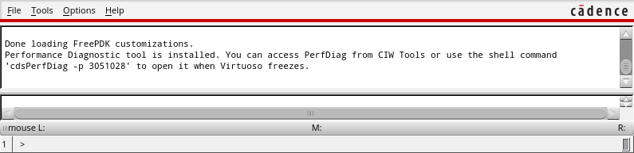

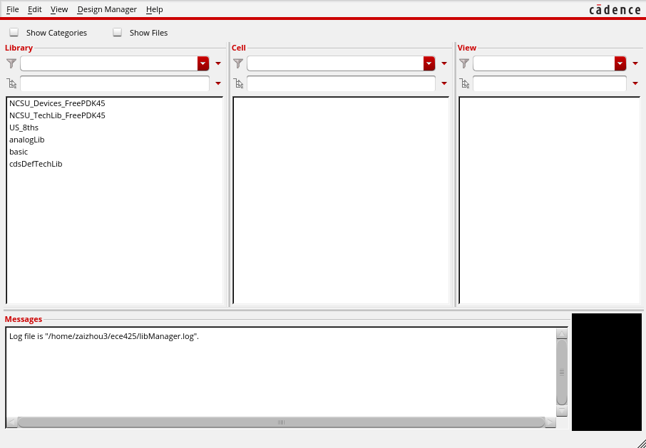

## Schematics
Before making any physical layouts, you need to first create the schematic of what you aim to build. 

Before you start to draw you schematic, you need create a new library for your design.
Library is like a folder in Virtuoso, which helps you be organized.

To create a library:

- In the `Library Manager`, `File --> New --> Library`
- It will default to put your new library in the new directory you created in the previous section.
  You should keep all your library here.
- Give your library a sensible name, and press OK.
- You will be prompted to select "Technology File" for this new library.
  This technology file is the definition of all the information related to the PDK (process design kit)
  we are using. We are using FreePDK45 by NCSU in this class. In this window,
  select "attach to an existing technology library", and select `NCSU_TechLib_FreePDK45`.

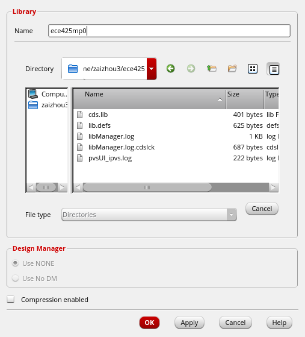

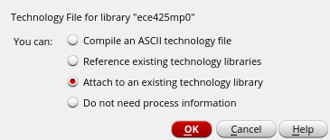

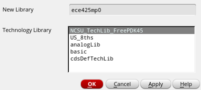

You can now create "cells" in your new library.
Cell is a unit of design in Virtuoso.
Within a cell, you have many "views", which are different aspects of a single design.
Say for example, there is a schematic view, and a layout view.

- First select the new library you just created in the left column.
- `File --> New --> Cell View`
- The `Cell` field is where you put the name. In this exercise, we are creating a inverter, so put `inv` in there.
- The view type here should be schematic.
- If a window asking about a license pops up, press `Always`.

You should now see the schematic window pop up.

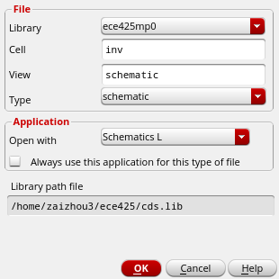

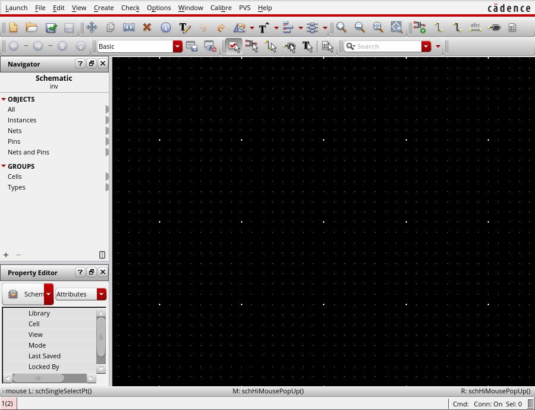

Lets create an inverter! This is what an inverter looks like:

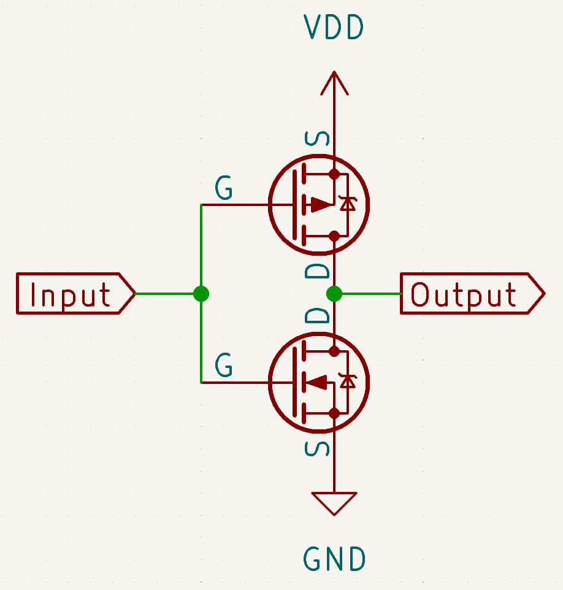

Lets try making one inside Virtuoso. We will use the provided symbol of MOSFET from our PDK.

- Press `Create --> Instance` (hot key `I`).
- In the `Library` field, select `NCSU_Devices_FreePDK45`.
  In the `Cell` field, select `NMOS_VTL`. Notice all of the fields that pop up.
  These are to parameterize the transistor. One field which you will use often is `Width`.
  For now, keep it at the minimum: `90n`.

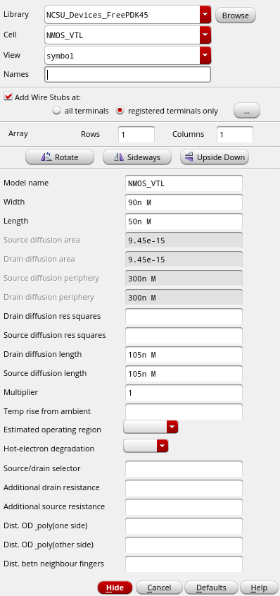

- In the `Schematic Editor`, place the transistor somewhere on the canvas.

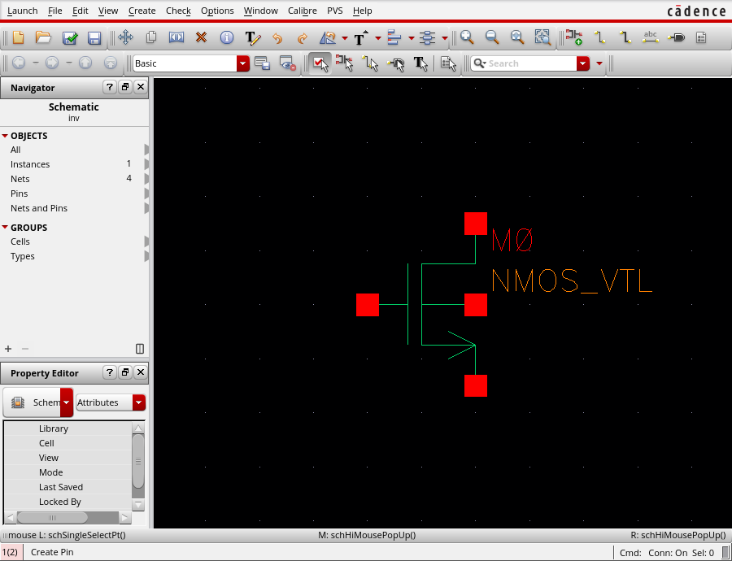

If you think you placed an instance incorrectly, do not fret!

To select an instance, left click on it. To unselect it, left click somewhere else outside the instance.\
To delete an instance, select it, then press the `Delete` key.\
To move an instance, press the `M` key, then select the instance you want to move. Or, just left click and drag the instance.\
To move an instance without disconnecting any wires, press the `S` key to open the stretch tool, select the instance you want
to move, then click on where you want to move it.\
To edit the parameters of an instance, select the instance then press the `Q` key.\
To undo, press the `U` key. To redo, press `Shift + U`.\
To zoom in and out, use the scroll wheel. To move left and right, hold `Shift` and use the scroll wheel.
To move up and down, hold `Ctrl` and use the scroll wheel. Alternatively, use mouse middle button to pan the view.
To reset your view, press the `F` key.

You have now placed your first P-cell (parameterized cell) instance! Now, let's add the PMOS.

- Place a `PMOS_VTL` instance with a width of `180u` (double that of the NMOS) right above the NMOS.
After placing, exit the `Add Instance` mode by pressing the `Esc` key.

Now, lets add the power and ground for this schematic.

- Create a new instance. In the `Library` field, select `basic`. 
  In the cell field, select `vdd` then place it above the PMOS.
  Then, select `vss` and place it below the NMOS.
  Notice the capitalization (all lowercase)!

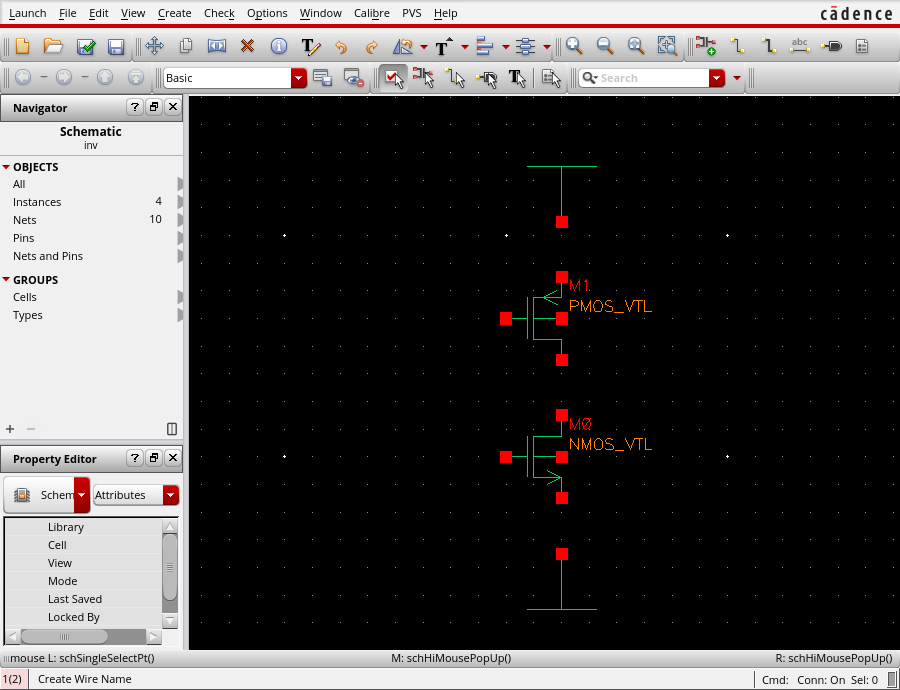

Lets now create the input and output pins for this schematic.
Pins are the outside interface of your design. In this case, it is the input and output of this inverter.
The naming convention we use here is that normal inputs take the name A, B, C ... and output take the name Z.

- Press `Create --> Pin` (hot key `P`). In the `Names` field, type `A`.
  Make sure that the `Direction` is set to `input`.
  Place the pin somewhere on the schematic.
- Create another pin named `Z`. Set the `Direction` to `output`.

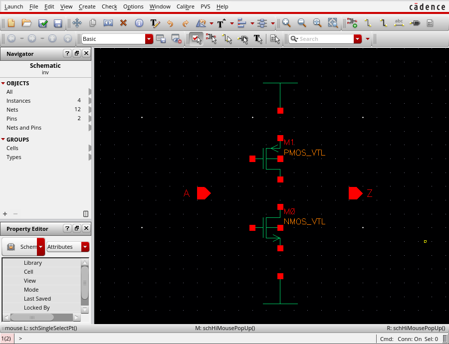

Your schematic would not be complete if you left out all the connections.

- Press `Create --> Wire (narrow)` (hot key `W`). Then, connect the dots!
  Don't forget about the body connections (NMOS body goes to `vss`, PMOS body goes to `vdd`).

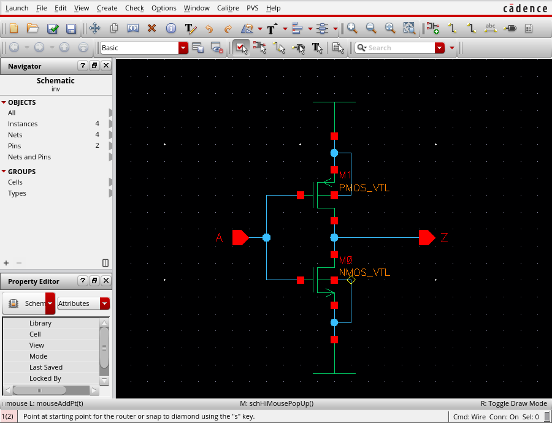

You have now created your first schematic! Lets save.

- To save, press `File --> Check and Save`.
  Alternatively, the tooltip symbol of this is the floppy disk with a check mark. 

The `Check` part of `Check and Save` means that Virtuoso also checks to make sure you have a valid schematic.
There are many reasons why a schematic can be invalid, but Virtuoso will tell you why and where your design is incorrectly connected.

For example, say I forgot to connect the body pin of my PMOS:

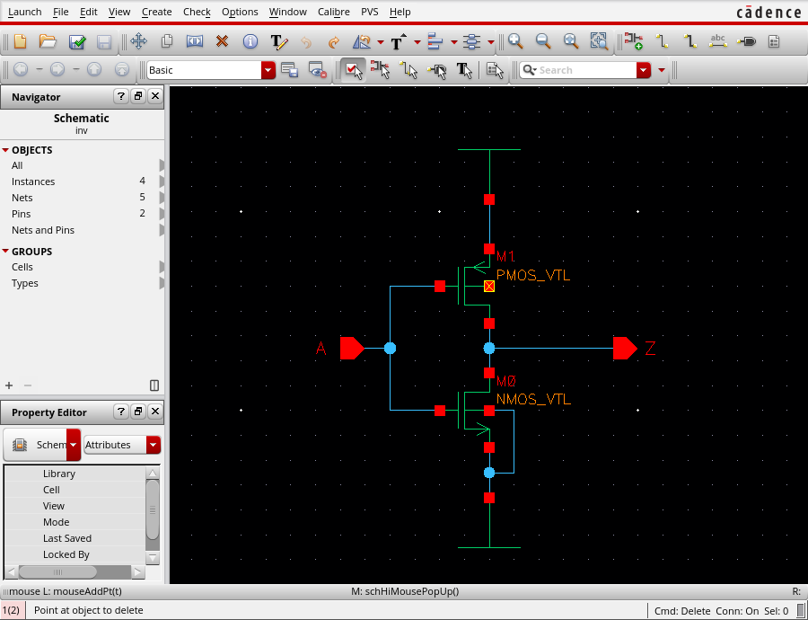

After pressing `Check and Save`, Virtuoso lets me know that something is wrong. If I look at the `Virtuoso Console` window,
it says `Warning: Pin "B": on instance "M1": floating input/output`. If I connect the pin then press `Check and Save` again, it will no longer complain.

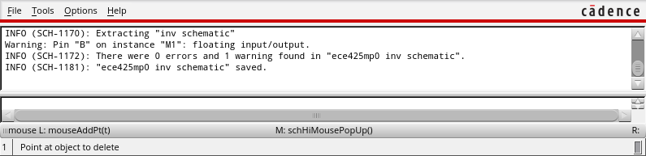

Of course we are going to construct bigger circuits using smaller parts.
In order to use your inverter in some other bigger schematics, you have to create its symbol.

- `Create --> Cellview --> From Cellview`
- In the window that pops up, verify that `Tool/Data Type` is set to `schematicSymbol`. Press OK.

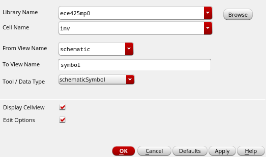

- In this new window, you can specify where your pins are oriented. The defaults should be fine. Press OK.


- Create your symbol! You can delete the ugly rectangle and make some custom shapes using
  `Create --> Shape`. As long as you don't delete the pins or the labels, you can draw anything you like.

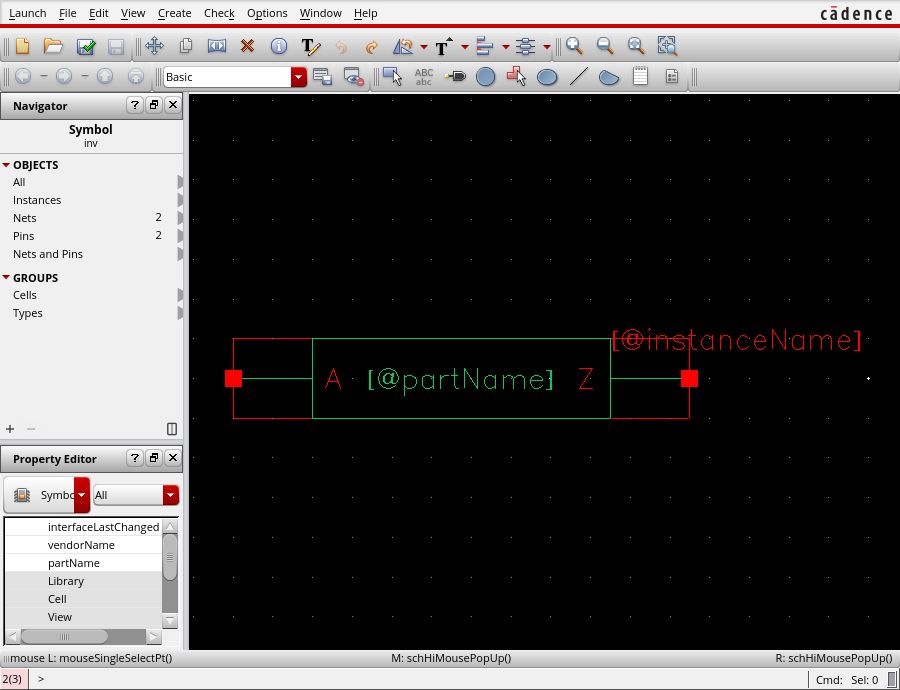

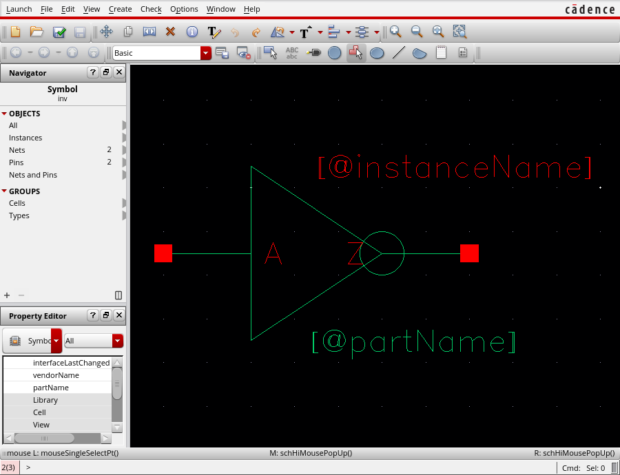

- Save your symbol.

Now, you can use this inverter in other cell views! Let's create another cell: a buffer.
Remember, a buffer is just two inverters chained together.

- Make a new cell called `buf`. Inside the schematic, place two instances of the inverter you just created.
  Add input pin `A`, output pin `Z`, and connect it all together. Don't forget to check and save!

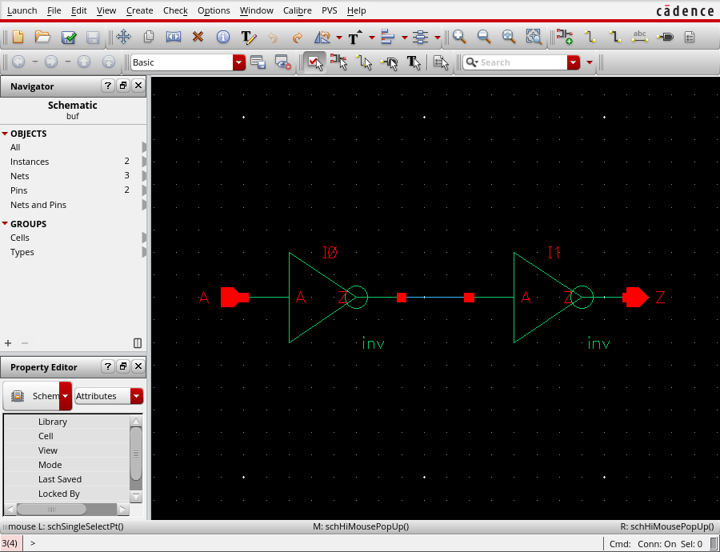

- Create a symbol for the buffer you just created.

You have now finished the schematics of your first two cells!

## Simulation (Analog)

This is where the fun begins.

Before you layout your design, it is wise to run simulation on it to make sure it is correct.
This section is the analog simulation of the circuit.

- Open up the schematic view for the inverter again.
- `Launch --> ADE Explorer`
- In launch menu, click `Create New View`:


In the create new view menu, make sure that the selected cell is inv, and that the view is maestro:

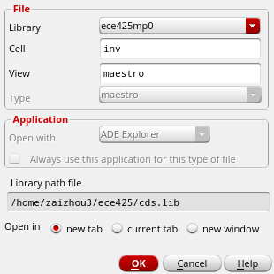

This should open a new window in a tool called maestro, where we will be running our simulation:

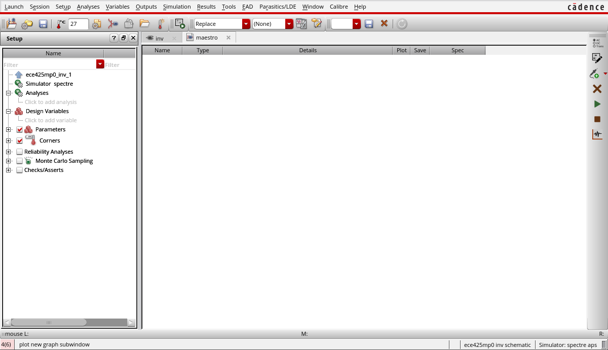

- Press `Setup --> Model Libraries`. We need model libraries of our transistors.
- Double click `<Click here to add model file>` and paste
  `/class/ece425/FreePDK45/ncsu_basekit/models/hspice/hspice_nom.include` in there.
- Click OK to set the model files.

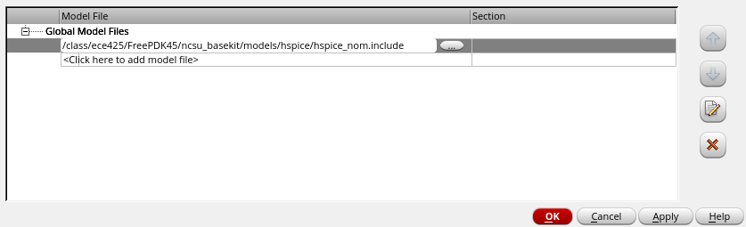

- In the maestro window, left hand side, press `Analyses --> Choose`
- We need to run a transient (time varying) simulation for 10ns.

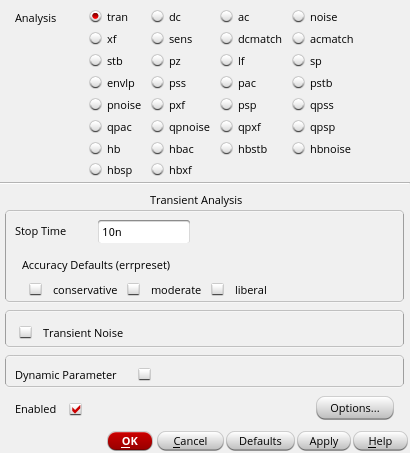

Next we want to set the simulation inputs for the circuit.

- Press `Setup --> Stimuli`.
- Turn Authoring on, such that we can create new input stimuli, the window should look like this:

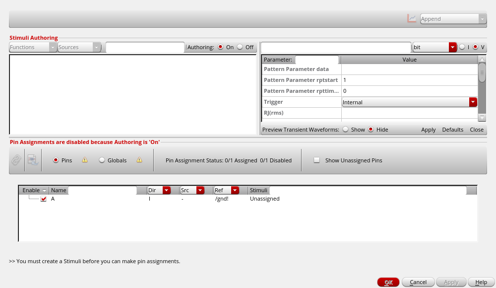

- To create vdd and vss voltages, make sure that the right side drop down menu is set to dc.
  Set the DC voltage to 1 and fill in the text field above with the name vdd like the picture below.
  Click Apply under the top right portion of the window.
- Do the same for vss voltage of 0.

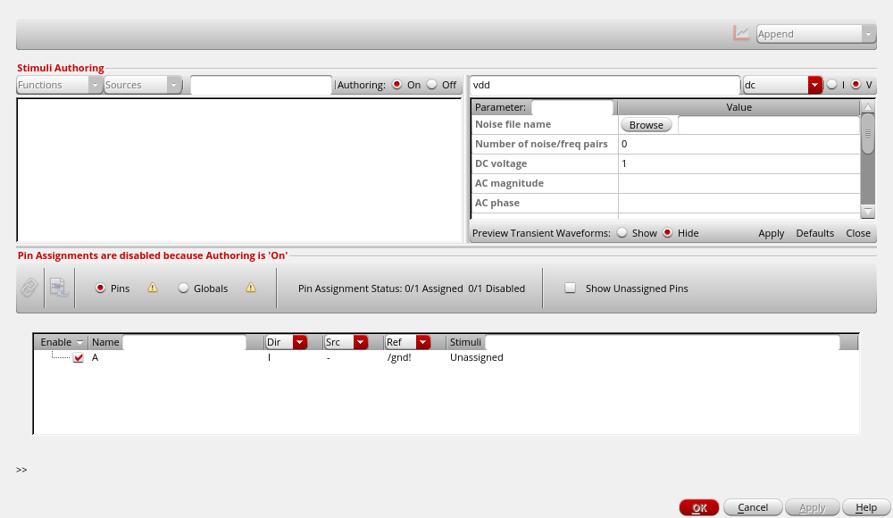

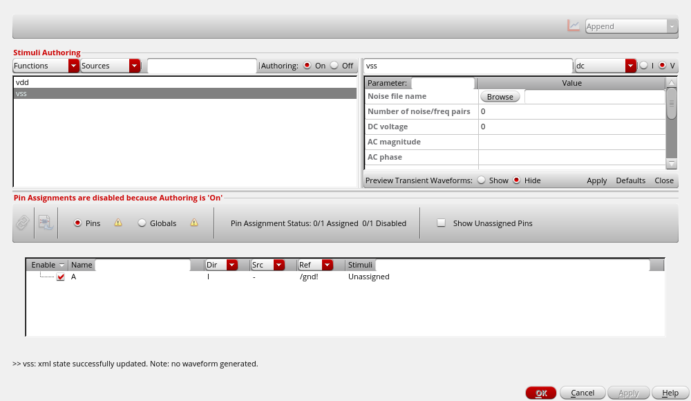

Now we create a input pattern to be applied on the pin `A`. 

- Change the dc menu to bit. Set the Pattern Parameter data to 0101,
  the One Value to 1, the Zero Value to 0, the delay time to 0, the rise time to 10p,
  the fall time to 10p, and the Period to 2.5n.
  The picture below is what the stimulus should look like. Name the Stimulus `in`.

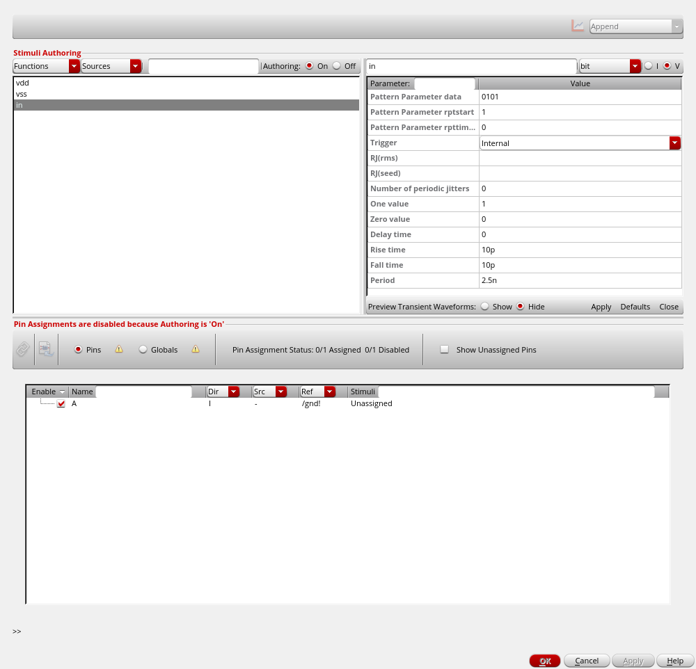

- To assign our stimuli to pins, first turn off authoring.
- Select the desired stimuli, e.g. `in`, and then the desired pin from the bottom menu, e.g. `A`.
  Right click `A` and click `Assign Stimuli to Selected Pins`. Now the stimuli input is assigned to `A`.
- Click the Globals button and repeat the process for vss! and vdd! such that it looks like this:

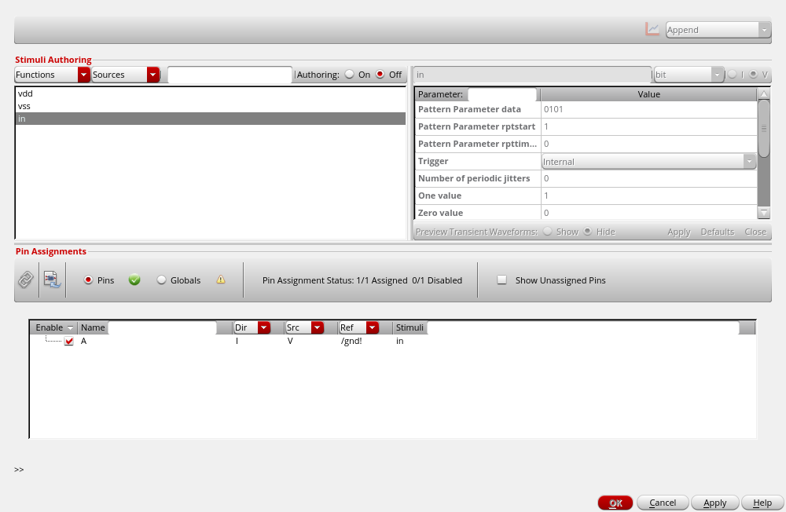

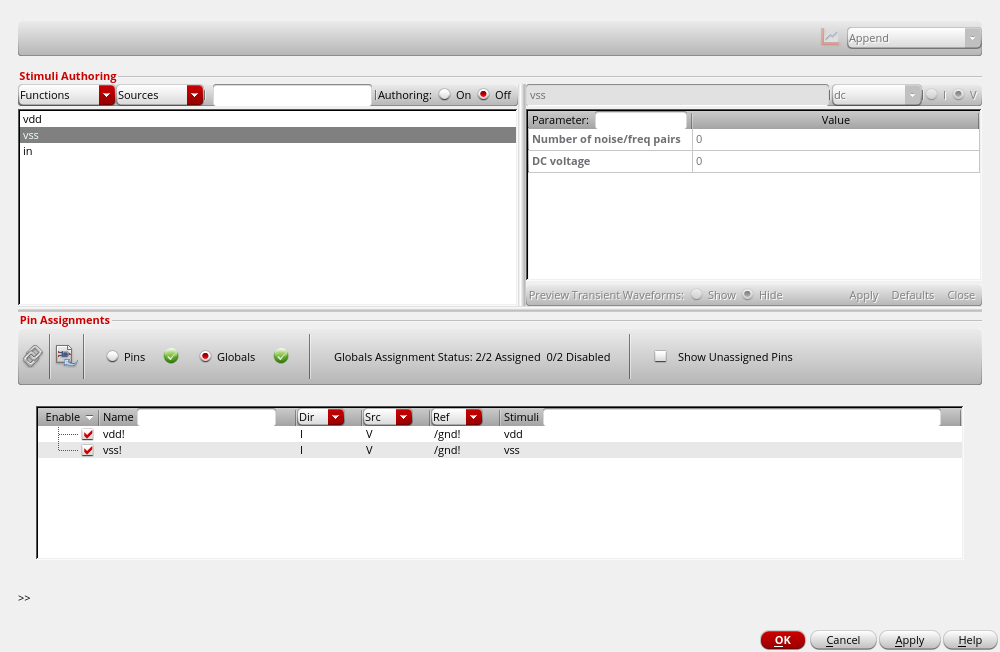

Now we have to setup what signal we would like to plot.

- `Outputs --> To be Plotted --> Select from Design`.
- On the schematic that pops up, simply click the desired part of the circuit, which will then be highlighted.
  In this example we are only interested in `A` and `Z`, and after clicking the net, the port and its wire will be highlighted like this:

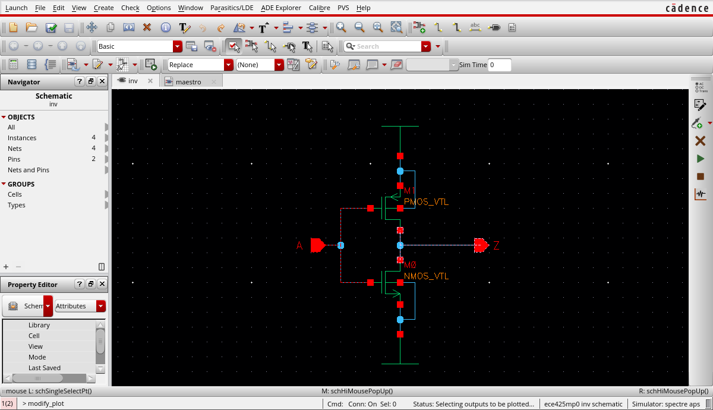

- Go back to maestro by click the maestro tab, shown below.

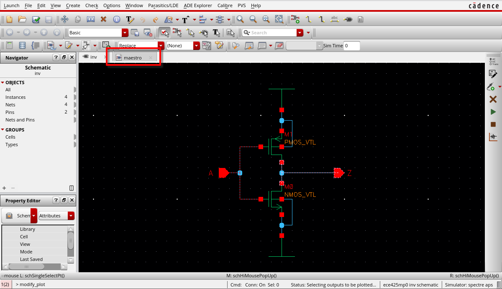

- Make sure that plot for your signals are selected, so that it looks like this:

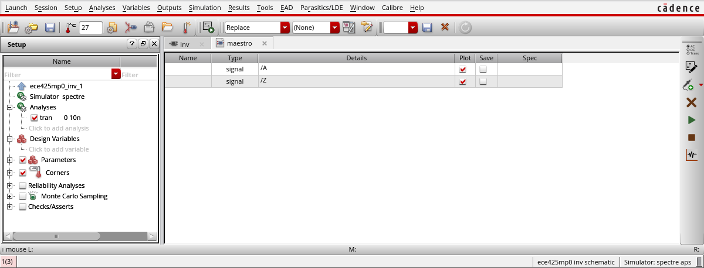

- Click `Simulation --> Netlist and Run`. This will run the simulation, which can take a while.

When the simulation is complete, you should see a graph like this:

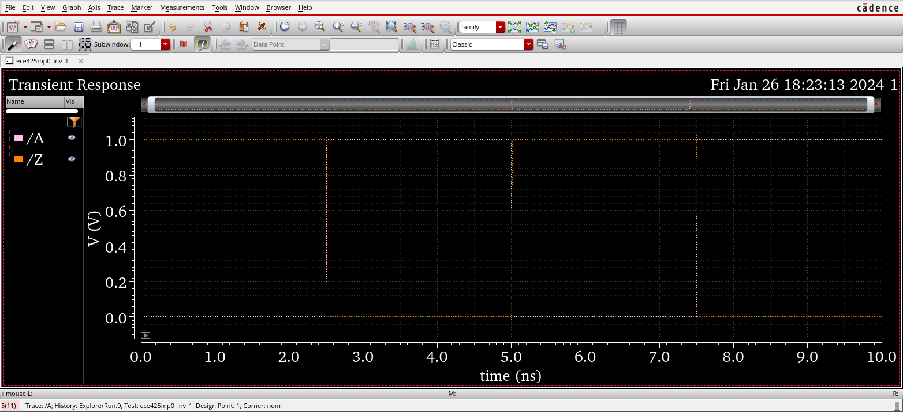

## Simulation (Digital)

This section is the digital simulation of the circuit.

First, we extract the netlist from the schematic window.
In the schematic window:

- `Launch --> Plugins --> Simulation --> NC-Verilog`

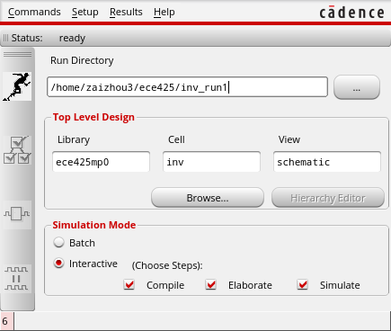

- Click on the red button highlighted below.
- Click on the blue button highlighted below.

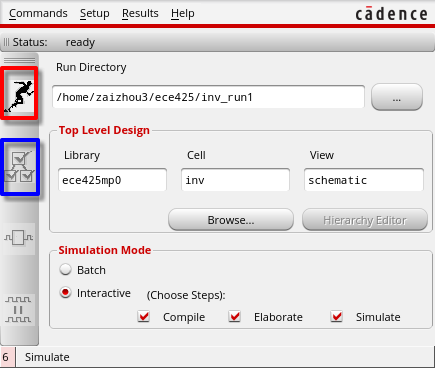

Now, the netlist is in `inv_run1/ihnl/cds*/netlist`. They are all Verilog files,
and each symbol referenced in your schematic get its own folder, recursively.
Also, your current schematic get one folder.

We will use the simulator used in ECE411 to run the simulation.
The simulator, Synopsys VCS, takes Verilog file,
spit out C files that behaves exactly like your Verilog, and compiles it to a executable.

We have provided the Makefile that contains everything about invoking VCS.
We have also provided the template testbench file.

- Copy the sim (provided in this repository) folder into the folder that NC-Verilog just generated,
  in this case, into `inv_run1`.

The folder structure should look like this:
  
```
inv_run1
├── ihnl
│   ├── cds0
│   │   ├── control
│   │   ├── map
│   │   ├── netlist
│   │   ├── netlist.footer
│   │   └── netlist.header
│   └── ...
├── sim
│   ├── Makefile
│   ├── mos.sv
│   └── tb.sv
└── ...
```

You should modify `sim/tb.sv` to include your test vector, as well as your dut (design under test) instantiation.
Your dut module can be found here: `ihnl/cds0/netlist`.

You can find the filled out example tb.sv in this repository.

To run compile the simulation:

```bash
$ make sim/tb
```

To run the simulation:

```bash
$ make run
```

To view the waveform:

```bash
$ make verdi
```

To view a signal (red text in the code window), select the signal, and press `Ctrl+4` or `Ctrl-W`.
You can use the mouse wheel to zoom in and out of the waveform window.

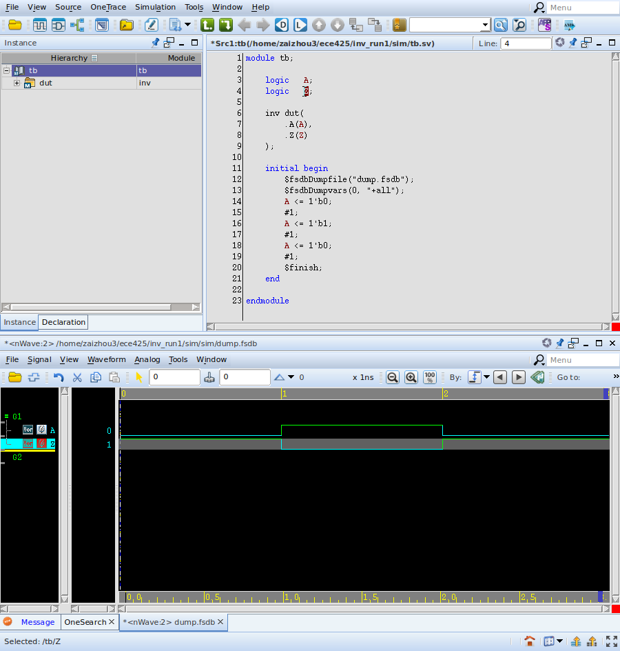

## Layouts

This is where more fun begins.

- Create a new Cell View for the `inv` cell. Set the `View` field to `layout`. A new window along with your schematic should open up.

On the left hand side is the layer manager.
Before you start drawing, you should specify which layer you wish to draw on.
Let's start with something simple, a rectangle.

- For now, let's select metal 1 drw layer.
- You should never draw in a `net` layer. Every layer you use will always be `drw`.
- `Create --> Shape --> Rectangle` (hot key `R`).
- On the canvas, draw a rectangle.

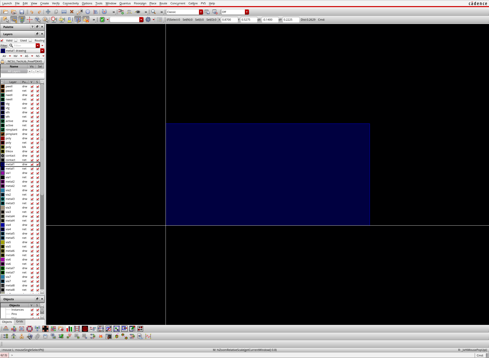

Rectangle is one of the many primitive you could use.
Path, is a smart type of rectangle. It is more like a wire you would use in schematic or PCB layout design: 
You can make turns with path.
By default, path tool will draw the thinnest path for this layer.

- `Create --> Shape --> Path` (hot key `P`)
- Draw some zig zag shapes, and double click to terminate the path.

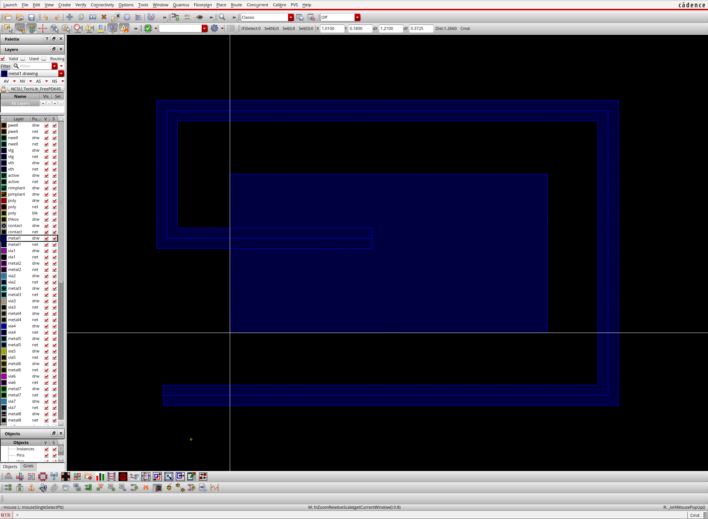

To figure out what size are the two shapes you have drawn:

- `Tools --> Create Measurement ` (hot key `K`)
- Place down your ruler.

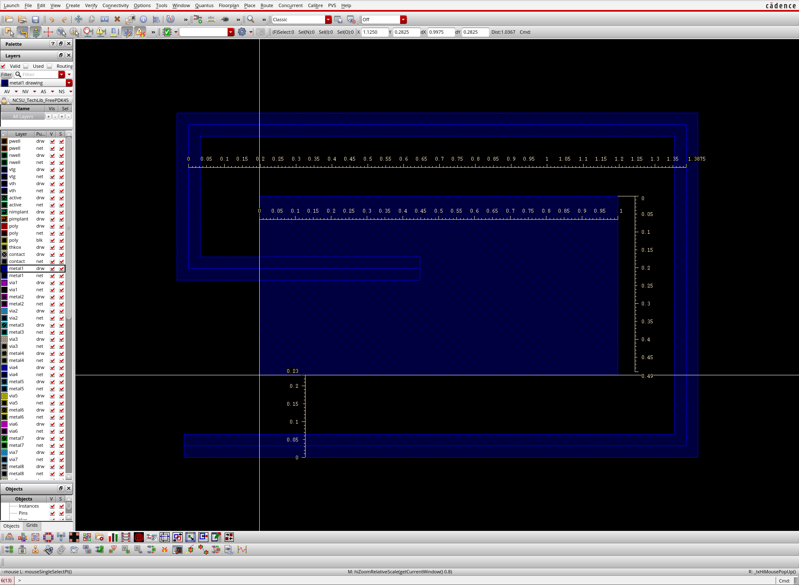

To move shapes around: `Edit --> Move` (hot key `M`).

To resize your shapes, first, make sure you are not selecting anything,
then, `Edit --> Stretch` (hot key `S`).

With these basic tools, you are ready to draw your first MOSFET layout.

Recall what are MOSFETs. Inside an intrinsic silicon substrate,
you first dope the substrate either P or N type. Next, you grow polysilicon 
(silicon that isn't a single homogenous crystal)on top of it, creating the gate.
Then, you use ion implantation to create a source and drain on the sides of the gate of the
opposite type of the well (N implant if P well, P implant if N well).
Finally, you add a metal contact for the source and drain.
But wait, there is more! You have to also create a well tap to bias the body.
Here is a diagram illustrating an NMOS.


You will now recreate this structure in Virtuoso.
Let's focus on the MOS itself first, we will leave the well tap for later.

- First, let's delete everything from the layout from the previous exercise.

- Draw all the components in the above diagram.
  Use path for metal 1 and poly, and use rectangle for everything else.
  We will worry about sizing later.

Two thing that differed from the simple cartoon above and the actual layout:
First, you should not draw two disjoint n-implant.
You should draw a contiguous n-implant rectangle from source to drain,
and draw a poly silicon right in the middle.
Second, the n-implant need to be completely covered by a rectangle on the `active` layer.
This is not only a marker to tell LVS where your MOS is, there is also some other complicated reasons. 
For more information on the two points above, you should take ECE 444. 

You should get something like this:

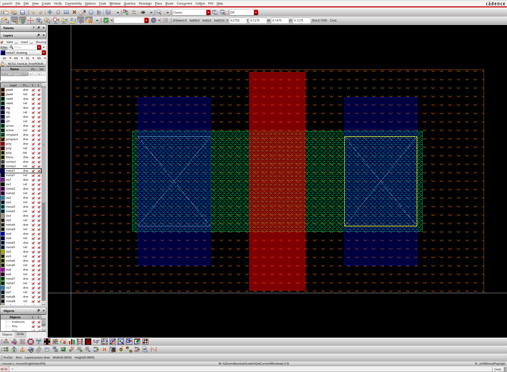

Now, let's worry about the sizing. The PDK specify a lot of design rules on what is allowed and what is not allowed.
Some example would be "metal 1 must be 0.065um or thicker" "metal 1 to metal 1 spacing must be at least 0.065um".

Let's launch the DRC tool, and ask it to check our MOS for us.

- `Calibre --> Run nmDRC`
- In the runset selection window, input `/class/ece425/FreePDK45/ncsu_basekit/cdssetup/runset.calibre.drc`.

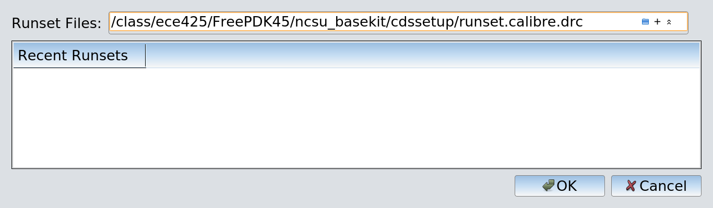

You should now see the following window:

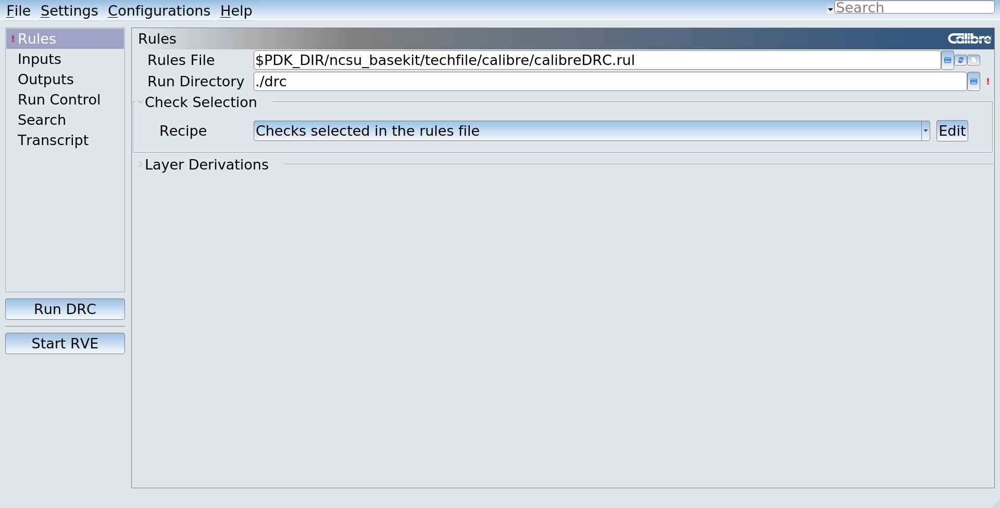

Click `Run DRC` on the left.
If prompted that the run directory does not exist, say yes.
If prompted to save your layout, say yes.
If prompted to overwrite file, say yes.

In a while, RVE (rule violation explorer) will popup.

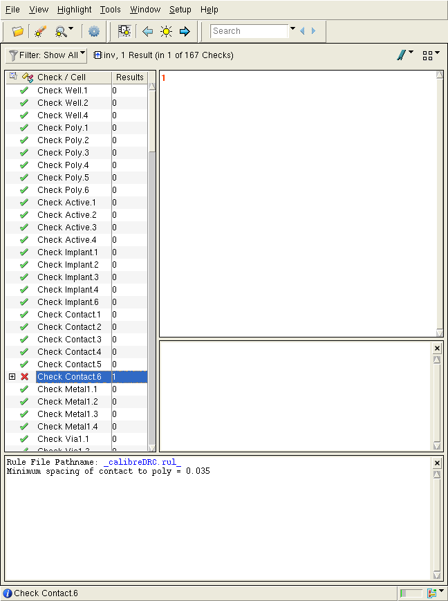

You will see all the passed and failed rules here. After selecting a rule on the left,
the window on the bottom will show the content of the rule,
say for example, in this screenshot, "Minimum spacing of contact to poly = 0.035".

On the right hand side, you will see some red numbers.
The number is the violation's serial number in this run.
Double clicking on the number will highlight the error in your layout window.

Some tricks about layer manager in Virtuoso: Select a layer,
and click on the top the letter V.
This will hide all other layers except the one you selected. V here means visible, S here means selectable.
You can now clearly see where is the violation and how.

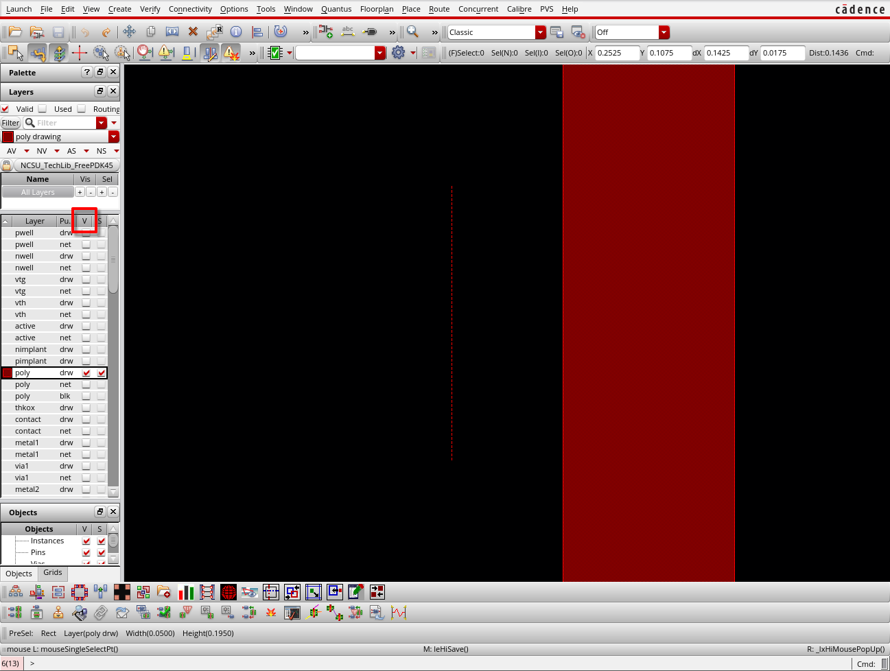

- Now you have access to the rule of what is the minimum of the design, try to draw the smallest NMOS.

- After you are done with the NMOS, draw the PMOS as well.

Let's connect everything to the transistors. 

- First, either use a path, rectangle, or the stretch tool (`S` key) to connect the gate and the output together.

- Next, create the power rails. Use the path tool and the `metal1 drw` layer. These we require to be 0.2u wide in the metal1 layer.
  Then, connect the other side of the transistors to the power rails. (source of PMOS to VDD, source of NMOS to VSS).

- Create the poly to metal 1 via. Press `Create --> Via` (hot key `O`), then select `M1_POLY` in the `Via Definition` drop-down.
  On the layout, you will see a red rectangle following your cursor. This is a via instance. Press `Shift + F`
  to see the shapes inside the instance. Then, place this via somewhere contacting your gate poly,
  but also far enough away from the output. Your inverter should look something like this:


- Finally, let's add some labels to denote each port. Press `Create --> Label`.
  Enter `A Z vdd! vss!` inside the `Label (Pattern)` field. Change the height to something smaller (like 0.1).
  Make sure your selected layer is `metal1 drw`. Then start clicking on the metal1 locations of the ports in the layout.
  Press the `Esc` key twice when you are done. Remember, `A` connects to the gate, `Z` connects to the drain of both transistors,
  `vdd!` goes on the top power rail, `vss!` goes on the bottom power rail.

If the place you are going to place the label on have multiple stuff underneath,
Virtuoso will prompt and ask you which one do you wish to attach the label to.
Choose the most sensible one. In general, it should be a metal drawing or a instance that contains a metal drawing.

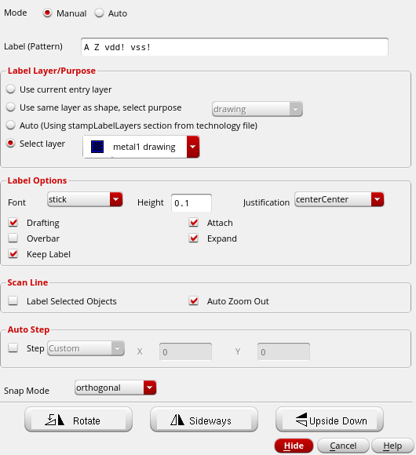

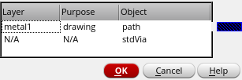

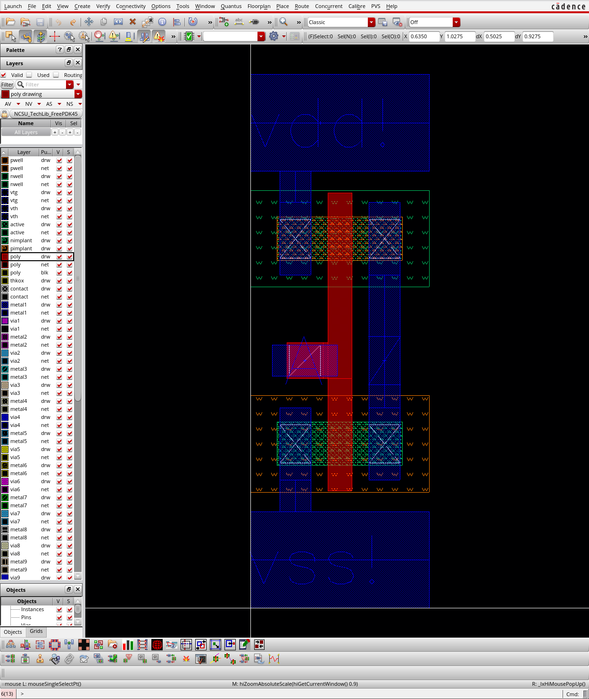

Before we can call our layout done, we should run LVS to make sure this is indeed what we want to draw.

Before running LVS:

- Press `Calibre --> Setup --> Netlist Export...`
- In the `Template File` field, enter in `/class/ece425/calibre_netlist_export.params`. After, press `Load`. Then, press `OK`.

This step needs to be done every time you open Virtuoso.

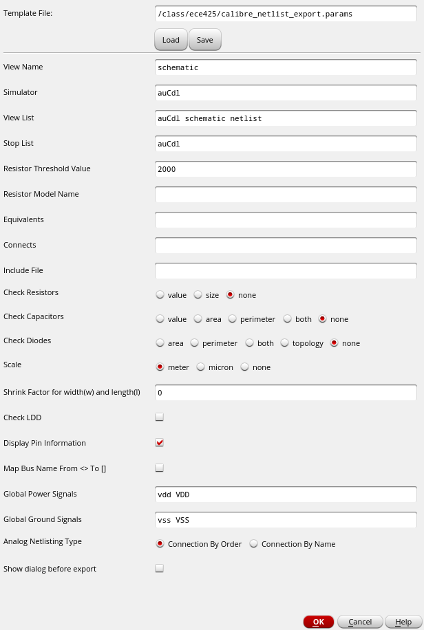

To run LVS:

- Press `Calibre --> Run nmLVS`.
- In the `Runset Files` field, enter in `/class/ece425/FreePDK45/ncsu_basekit/cdssetup/runset.calibre.lvs`. Then, press `OK`.

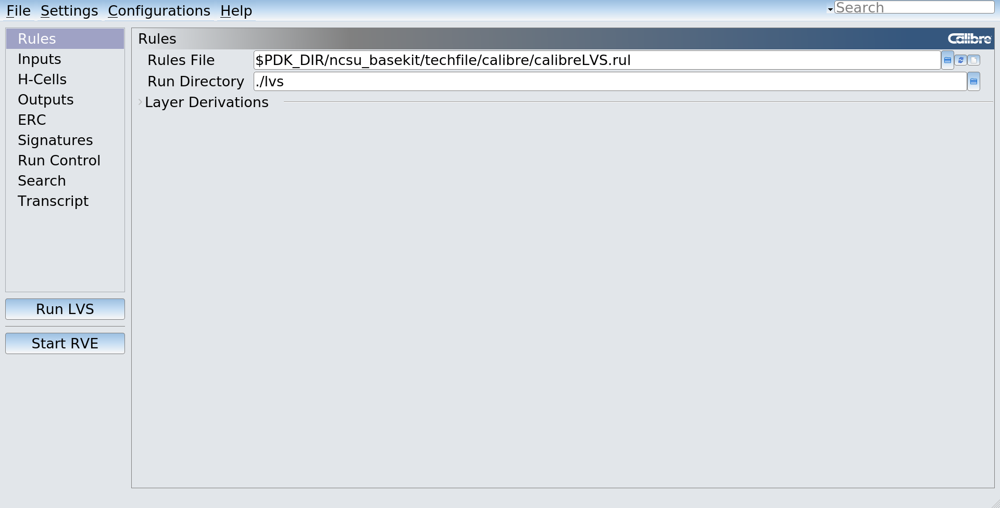

- Press `Run LVS`.

In a while, RVE will popup.

Here is what it would look like if you have errors:


Let's see what the error is. Click on the details of the error.

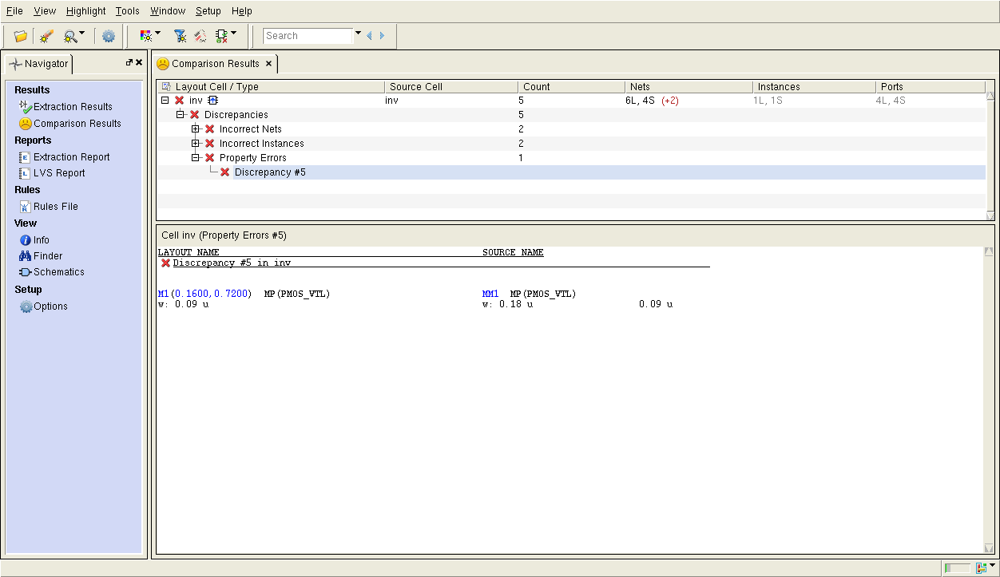

Looks like we forgot to make the PMOS double the width of the NMOS. Go back to the layout,
and make the gate width of the PMOS twice as large. This will require stretching nearly every layer there.
You can also select a shape, then press the `Q` key to view its properties, and change them, to set the height to something specific.

- Make sure you are still passing DRC, then re-run LVS.

We still have some more LVS error to fix. Lets look at the incorrect net. In the violation window,
double click on text that are either red or blue, in this case, its Net 5:

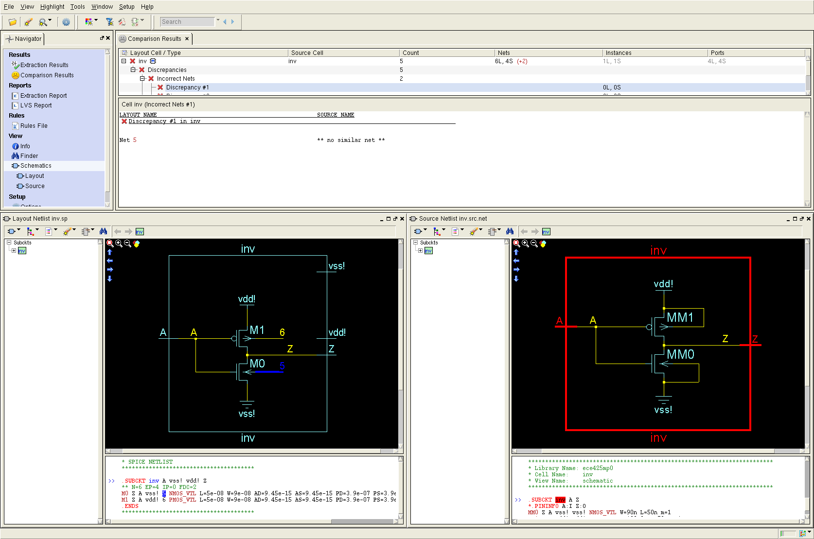

It is easy to see that we have forgot to include the body connection of the MOS.
Let's add that to the layout:

- `Create --> Via`. Select `PTAP` and place it on the `vss!` rail. Select `NTAP` and put it on the `vdd!` rail.
  Make sure the wells are connected to the tap's wells by drawing rectangles in either pwell or nwell to connect them.

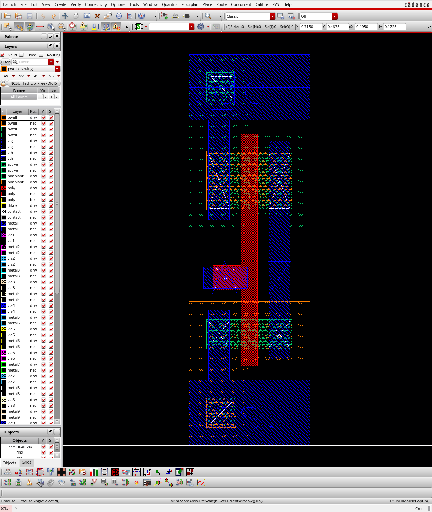

- Re-run LVS, and it should now be passing!

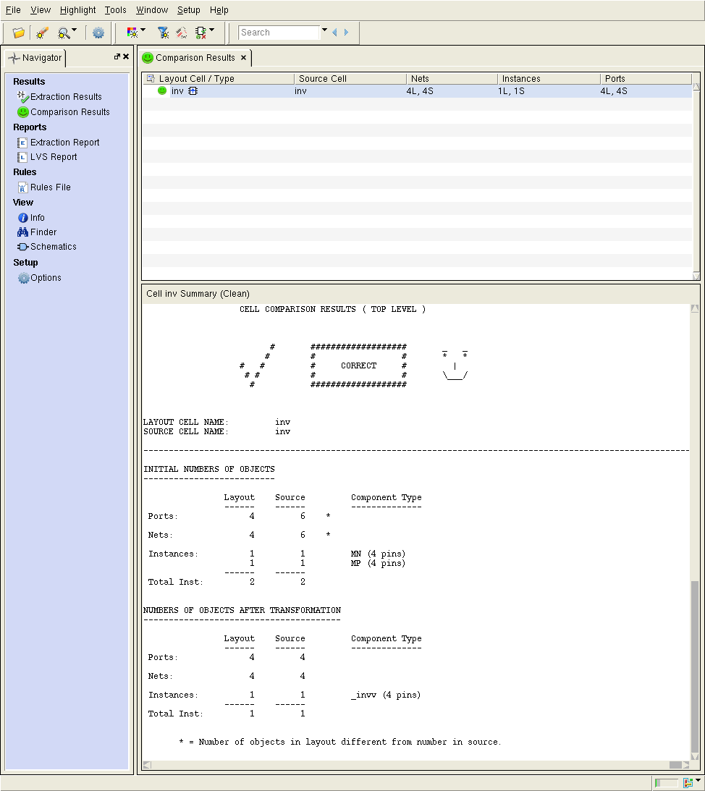

- After this, create a buffer layout. Remember, you can place two inverter layout instances, and just connect them together!
  Don't forget to add the labels again to name all the pins, and re-run DRC and LVS.
